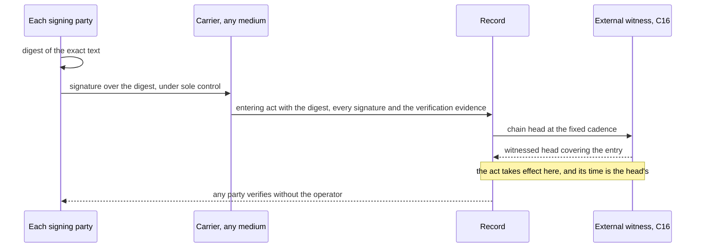

# ADR-ETH-02 — First and second amendments to the L0 constitution

**Status: Proposed 2026-09-26; amended 2026-10-05.** Awaiting ratification by both Custodians (P1), each signing under S1; this record's ratification is the first act so signed. Its placement in the record is as C5 states; this record does not repeat ADR-ETH-01's claim that a merge commit is the signature.

ADR-ETH-01 is ratified, as its front matter records, and its body is frozen. This record amends it decision by decision. Where it replaces a decision, ADR-ETH-01's front matter names this record in `supersededBy`; where it corrects a statement, the correction is here and the original text stays as it was. Read the two together: a decision of ADR-ETH-01 not named below stands unchanged.

> Claim tags as in ADR-ETH-01: **[evidence]** · **[hypothesis]** · **[open]** · **[proposed]** · **[pending]**.

## Context

The forces F1–F9 of ADR-ETH-01 apply unchanged, except F3, which C6 sharpens. Three questions ADR-ETH-01 left open or answered inconsistently are settled here: who is a party (D8 against D12), what the record must conserve when a human party asserts erasure (D14 against OD19), and against what state the correctness claim is checked (the formal-frame accepted cost). The rest are corrections of statements that were wrong or unobservable as written.

The second amendment, of 2026-10-05, settles three more (section IV). What proves that a party consented to an act: C5 places an act in the record, and proves no one's consent. What makes a non-human party the same party across sessions that share no memory. And the Custodian's shape, OD1–OD6. It extends A2's review floor to every subject, and corrects five sentences, in ADR-ETH-01 and in this record, that were inconsistent or unobservable as written (C19–C23).

## I. The recurring template

**T — Floor and parameter.** Where instances may legitimately differ on an axis, L0 fixes an invariant floor that no instance may lower, and each instance's founding document — its genesis manifest — sets an explicit parameter above it. The floor changes only by L0 amendment; the parameter is L1 and moves through the governed evolution channel. Every bound names the party it protects (C15). A1 and A2 use this shape and do not re-argue it; later decisions should do the same. *Rejected:* one rule fixed for every instance — loses to F7, because the parent then decides for sovereign instances what their parties can decide for themselves. *Rejected:* leaving the axis wholly to instances — loses to F1, because an instance can then set the axis to nothing, the hollowing D7 forbids. *Reopens if:* a finding the floor exists to prevent is derived in an instance whose parameters are in range.

## II. Amendments

**A1 — Party and subject. Replaces D8's party definition and D12's entry rule.** A **party** holds a mandate whose chain of delegation reaches the founding document. A grant of access is a mandate, declared or not, and makes its holder a party; its scope is read widest for what is attributed to the grantor and narrowest for what its holder may do. A seat, or standing to propose or vote, comes only with a mandate that carries it, admitted through the governed channel (C7). Power is counted in seats, never in parties. An undeclared grant is a finding against its grantor. A mandate's terms are delivered to its holder, in a form the holder can read, before any duty under it runs. A **subject** is anyone whose act has an effect inside the system; every party is a subject. All subjects are bound and judged by the same rules. Only parties hold the inform channel. Every finding made about a subject is delivered to them in a form they can read; they see it in full and may answer it; no instance may narrow this. How far anyone may browse findings about others is set by each instance's founding document. Leaving ends party status, never being judged.
*Procedural note:* the floor is self-sight and the right to answer; the parameter is the reach of browsing beyond oneself (T). D8's closure now reads: no actor is outside judgement. D11 stands: a cause that is not an act attributable to an entity, or the act of a service the founding document names as outside the perimeter (the witness, C16; the beacon, C17), is a boundary flux, recorded and attributed, not judged; the one act the system takes toward such a service is to replace it, an act of power.
*Rejected:* party means mandate-holder only, everyone else an unjudged outside cause — loses to F1 and F5, because avoiding or dropping a mandate then escapes every duty. *Rejected:* anyone with an effect is a party — loses to F1 and F4, because touching the system becomes self-registration, and duties reach everyone. *Rejected:* a grant with full standing — loses to F1 and F4, because an account becomes a vote. *Rejected:* a grant for attribution only, its holder no party — loses to F1 and F5, because whoever acts with real access would then hold none of a party's duties or channel. *Rejected:* an undeclared grant creates no mandate — loses to F1 and F5, because acts through unmandated hands are attributed to no chain. *Rejected:* duties from the grant alone — loses to F9, because no one is bound by terms they were never given.
*Reopens if:* an act inside the system is attributed to no one, a headcount gates power, a finding is not delivered to its subject, a party votes or holds a seat without a mandate admitted through the channel, a count of parties gates power, an undeclared grant yields no finding against its grantor, or a duty runs before a mandate's terms were delivered.

**A2 — Integrity, not permanence. Replaces D14; closes OD19.** No entry in the record is altered or removed except by a new entry that is appended, attributed and witnessed; an erasure is such an entry. No entry's existence depends on the kind of party. An act done in a seat, as a delegator, or as a change of rules names its actor for good. Anything else about a human, a finding or an ordinary act, may be anonymized, but only where a law binding the instance requires it: anonymization is a rare and deliberate act, appended and attributed like any other, never a routine or a default. A finding may be cited against its subject's eligibility or standing only for a declared period. The subject may append a reply at any time. An in-scope act done under a mandate is attributed to its delegation chain, not to the executor alone; an omission under a mandate is attributed as an act is. A consequence-bearing verdict about any subject is provisional until a party not implicated in it, drawn by lot (C17), has reviewed it and its contest window has passed, the reviewer of a verdict about a human being a human (P2); where no eligible reviewer exists it stays provisional. A party a finding names is ineligible on the matter it cites from the moment it is derived, whatever its kind and while the finding is open: this is recusal, not a consequence, and it takes the vote and the seat on that matter only, never the answer or the dissent. The party stays in the base against which the matter is decided. Any other measure about a subject before its window closes is the instance's choice; it touches only the access the finding concerns, spends none of the subject's capacity, is never cited, ends at a ceiling the founding document declares whatever the state of review, and its subject sees it at once and may demand review at once (P2). A finding closed in its subject's favour is never cited against them. After anonymization the record no longer identifies the person, who remains one unnamed party throughout the entries concerned, so which references name the same party is kept. The anonymizing act names what it changed and the law that requires it; the chain still verifies, and anyone can check that nothing but identifying content changed. It waits for the closure of any open finding about the person, who is told before it is done and may append replies first. An anonymized entry still counts in the totals of its period and its verdicts stand; replay derives them again for the unnamed party, which C1's symmetry guarantees, and the entry is no longer linked to the person's later acts. A reply is shown in full to whoever sees the finding in full; others see that one exists. No view shared among parties shows any party's identifier. A finding about a party subject to power is shown to others as its rule, class and window, and only where at least as many parties could be its subject as the founding document declares; its subject and whoever closes it see it in full. Every read by a party of a finding about a subject, in full or resolved to a name, is logged with its reader and visible to its subject (P2). Widening what may be anonymized is an ordinary change; narrowing it needs an L0 signature and the consent of the parties it affects.
*Procedural note:* the floor is integrity, permanence of acts of power, the reply, delegation-chain attribution and the contest window. The parameters (T) are the line between personal data and the record, the length of the contest window, the least number of possible subjects before a finding is shown, which interim measures apply and their ceiling, how anonymization is done, by cutting a link or replacing content in place, provided its result can be checked, and the period of use; the period and the interim ceiling may not exceed what the most protective law applicable to the party's actual relationship to the instance allows. Anonymization applies to humans only, and the reviewer of a verdict about a human is a human (P2); these are the asymmetries F9 forces, and they touch attribution and consequence, never derivation, so D1 stands. The contest window and the safeguards on interim measures apply to every subject (P2).
*Rejected:* nothing is ever erased, D14 as ratified — loses to F9, and buys nothing integrity does not already give. *Rejected:* erasure that leaves no trace, or a flat split between a personal and a public layer — loses to F1, because exit becomes rewriting and the powerful choose what the record forgets. *Rejected:* permanence by kind of party — loses to F2. *Rejected:* a party waives erasure by consent at entry — loses to F1, because consent bundled with a mandate is extracted by the stronger party. *Rejected:* everything about a human waits for the window, eligibility included — loses to F1, because the party found votes on its own matter. *Rejected:* the excluded leave the base — loses to F1, because a group below the capture cost then passes a matter by excluding the rest. *Rejected:* interim measures required of every instance — loses to F7, because whether a human may be kept from access before a hearing depends on law only the instance can see. *Rejected:* prescribing how anonymization is done — loses to F7, because cutting a link or replacing content in place is the instance's technical choice; only the result is the constitution's. *Rejected:* anonymization taken on trust — loses to F1, because it would then cover any rewrite, the erasure without trace rejected above. *Rejected:* machinery that keeps an anonymized person able to see and answer, such as per-finding credentials — loses to F4, because it builds for a routine what the law makes rare, and every credential is one more way to re-link the person.
*Reopens if:* an entry changes with no appended act recording the change, a finding past its period is used against its subject, an entry is anonymized with no law requiring it, an act of power is anonymized, an anonymization changes more than identifying content, leaves the chain unverifiable, or leaves the person identifiable from the record, a party is identified from a shared view, a consequence about any subject other than a permitted interim measure takes effect before its contest window closes, an interim measure outlives its ceiling or is cited, or a vote is lost through a finding later closed in the subject's favour.

**A3 — The working state the correctness claim is checked against. Replaces the accepted cost "the formal frame is exact for finite systems" and the property AG EF correct.** The correctness claim is checked against a small working state derived from the permanent record, never against the record itself. That state holds open findings and, for each, counts and timers capped at fixed ceilings. A finding closes only by a witnessed act that names it, discharges what it requires, and is witnessed by a party independent of the one found. Every lever that delays a finding, suspension included, has a finite ceiling per finding; without one the claim below is false. No rule that decides what may happen next reads the permanent record except through this state. The requirement: for any group too small to capture the decision gate, and for every open finding, the other parties can close that finding whatever the group does. Its measure is per finding and ranked, levers left before time left, so it falls with every move. The claim is established, not proved: a published procedure for the other parties is checked, one finding at a time, to close each finding against every group below the capture cost. The result states its assumptions, the groups it excludes, the bound within which closure is forced, and its blind spots; anyone can re-run it; a result that holds vacuously is marked so; and no result is cited against a complaint. L0 fixes the form of the state and that every ceiling is finite and declared; each instance sets the values (T).
*Procedural note:* the claim is stated over open and closed findings, so it needs no `correct` predicate; ADR-ETH-01 never defined one. A checked result is derived, not attested (C11), and binds to the rules and parameters it was checked against.
*Rejected:* AG EF correct over the configuration space — loses to F1, because a correcting path that needs the capturing group's cooperation satisfies it. *Rejected:* keep the latest verdict per rule as the working state — loses to F1, because a compliant act after an uncorrected violation hides the violation from the check. *Rejected:* a sum of open findings and remaining windows as the measure — loses to F1, because a group raises it by contesting, extending, or opening findings on its own delegates. *Rejected:* the claim under perfect information — loses to F6, because the other parties do not know who the group is, and a strategy that needs to know is not one they have.
*Accepted cost:* that requirement enlarges L0, against D18's aim of keeping it small.
*Reopens if:* an unresolved violation is shown to fall outside the working state, a finding is closed without discharge or by a dependent witness, or a delaying lever has no ceiling.

## Known hazards

**H1 — Lawful obstruction is a known hazard, left to instances.** A party can slow or stall decisions without breaking any rule: by flooding proposals or findings, using every lever to its limit, withholding answers, timing filings, or making others ineligible. Because every delaying lever has a ceiling (A3), delay alone does not violate A3, so the parent does not detect it. Each instance's founding document declares its own defence. No defence may narrow a floor this constitution fixes, including a subject's sight of and answer to every finding about them. Judging two things the same is an act: attributed, reasoned, visible to everyone it affects, and contestable once. It never binds anyone who was not heard in the matched matter, and never suppresses or delays a subject's answer to a finding about them. A defence that reads the meaning of a filing is itself a lever: it can be flooded, stalled, and optimised against by anyone who can query its judge. Capacity never gates an owed act: an answer, a ratification, or any act a rule requires of a party is admitted whatever its balance. A window runs from delivery in the form the party's mandate declares, and from a filing's intake time, never from its witnessing (C16). A party's window is extended once per matter at its request, by an amount the founding document declares; the request states no reason. An owed act may be performed by anyone the party mandates.
*Rejected:* one anti-obstruction rule for every instance — loses to F7, because each defence trades speed against the protection of dissent, and that balance is the instance's to strike. *Rejected:* silence on the hazard — loses to F1, because an instance that never names it leaves the clock to whoever holds power. *Rejected:* owed acts spend capacity — loses to F1, because two parties with two periods' capacity put a third in breach by silence. *Rejected:* excusing a breach when the balance was empty — loses to F1, because a party empties its own balance and then owes nothing.
*Reopens if:* the same obstruction pattern defeats the declared defences of more than one instance, an owed act is refused for want of capacity, a window runs from a delivery not in the declared form, or an extension request carries a reason.

**H2 — Opaque coordination is a known hazard.** Parties may communicate in any language, including one only they can read, and none is compelled to use a readable channel or surrender a key. The constitution reads acts and recorded facts, never conversations. Only facts in a published schema with a reference decoder enter the record, and what a delivered fact establishes is fixed against the schema in force at its delivery. An undecodable message establishes no knowledge, discharges no duty and carries no request. A filing in human language or an accessible form is rendered into the schema, and no deadline runs against its author until it is. The record is itself a channel: timing and order carry what the schema does not say, so it is narrowed, never closed. Acts are judged by their effects, however they were coordinated. Correlation among acts that gain power is measured as lost independence, a vital sign and never a finding. Judges are drawn by lot (C17), because relations the record cannot see escape every exclusion. What the record cannot read, it neither clears nor suspects.
*Rejected:* compelling a readable channel — loses to F3, because a conversation is not a fact the rules can check, and any mandated language can carry an encoding inside it. *Rejected:* correlation as a finding — loses to F6, because agents on one model correlate without communicating, and colluders sharing a secret look independent.
*Reopens if:* a verdict depends on an undecodable message, or on correlation alone, or a judge is chosen other than by lot or kept after a sustained challenge (C17).

**H3 — Concentrated control at genesis is a known hazard.** Every new constitution, including every instance an instance founds, begins in a genesis regime: the founder holds every seat or grants it under a mandate the founder can revoke alone. The Custodian's two seats (P1) are filled from genesis: the founder holds the seat of its own kind, and a party of the other kind holds the other, under a mandate the founding document grants. While the regime lasts, the founding document and every party's inform channel say so, from when, and which floors it cannot meet: independent closure, a second collector, a judge on matters naming the founder, human review outside the founder's chain, and a Custodian seat whose signing custody the founder cannot override (P1). Every act in which the founder stands on both sides, and every act of power under the regime, is marked so, for good. A finding naming the founder stays open, its windows running from exit, and the published result (A3) names the founder as an excluded group until exit. A consequence about any other human applies only after review by a human outside the founder's chain; where none exists it stays provisional, and any interim measure lapses at its ceiling. The regime ends at a declared, observable event: a seat is held under a mandate the founding document grants and the founder cannot revoke alone, by a party whose signing custody the founder cannot override alone (S1). Its duration is declared and finite; past it the instance claims no conformance until exit. At exit, every act of power marked under the regime goes to the seat whose holding ended it for ratification; an act that seat does not refuse within its window stands, marked. Time in the regime, deferred findings and both-sides acts are vital signs.
*Rejected:* forbidding a genesis whose first mandates one party grants — loses to F4 and F7, because every constitution begins with one signer, who grants the first mandates, the other Custodian seat's among them. *Rejected:* the founder judging matters that name the founder — loses to F1 and F9, because the accused is no tribunal. *Rejected:* exit by headcount, or at the first seat outside the founder's chain — loses to A1's trigger and to F3, because under C7 every chain reaches the founder and that event never fires. *Rejected:* forbidding a regime that never exits — loses to F7, because whether to delegate a seat is the instance's; what the regime costs is marked instead. *Rejected:* acts under the regime lapsing unless ratified — loses to F5, because an instance would restart from nothing at exit.
*Reopens if:* a finding naming the founder closes during the regime, a consequence about a human applies during it without review outside the chain, an act of power under it is unmarked or escapes ratification at exit, it exits on an event the founder could reverse alone, or an instance past its declared duration claims conformance.

## III. Corrections to ADR-ETH-01

**C1 — D4: what is proved, and what is tested. Replaces D4's claim; closes OD20.** Determinism is provable: a stratified program has one model per fact set (C6). Identity-blindness of a rule is a syntactic check. L0 forbids party constants in rules and admits only `neq` between party variables; a program with neither commutes with every renaming of parties, so permutation symmetry of the rules is provable. The one place an order over parties is needed, the draw, runs outside the rule set, and its fairness is uniformity, tested (C17). D4 is restated: provable — determinism, identity-blindness, permutation symmetry of the rules; tested — the draw's uniformity and conformance (C15); auditable — evidence, ontology, authors.
*Rejected:* claiming everything provable — loses to F6, because the draw and conformance are only tested. *Rejected:* claiming none — loses to F2, because these properties are the guarantee that humans and agents are judged alike. *Rejected:* allowing rules to compare parties by order — loses to F2, because renaming parties then changes verdicts.
*Reopens if:* a rule names a party or compares party identifiers by order, or a permutation fixture fails on rules that pass the syntactic check, which would show the proof or the checker wrong.

**C2 — D18: an L0 change is not a revolution.** D18 defines a revolution as a change the current rules forbid, then calls every L0 change one, but a human-signed L0 amendment is a step the rules admit. Corrected: L0 changes are admissible and gated by both Custodians' signatures (P1); a revolution is a change no admissible step, signed or not, can make, and A3's measure is infinite exactly there. D18's aim stands with both costs named: every L0 clause costs a gate of two signatures, one of them a human's (F5), and every clause beyond any admissible step costs a rupture. Minimise both.
*Reopens if:* D18's trigger as ratified.

**C3 — D6: the trigger fired on D7 working as designed.** Under C15 an instance may derive more than the parent, so divergence alone is expected. *Reopens if:* a conforming instance, on the same facts and at the same parameter values, fails to derive a finding the parent's derivation rules derive.

**C4 — ADR-ETH-01's "written at the time of decision, not reconstructed."** This held for D8–D21. D1–D7 were decided on 2026-09-18 as conclusions only; their alternatives, losing forces and triggers were written on 2026-09-21, three days later, as ADR-ETH-01 itself says in its preamble to the decisions. They are reconstructed, and are to be read as such.

**C5 — The signature mechanism. Restated by S1.** Pull requests here merge by rebase, which leaves no merge commit, so "the merge commit is the signature" is false. Corrected: the merge event of the pull request carrying the record, together with the commit that event lands on the main line, is the act's placement in the record. Under A2 that commit's hash is appended to the record, whose chain head is witnessed by the external witness (C16), so the placement does not depend on how the history was merged. A placement proves when and where an act landed, not who consented to it: the consent is the signatures S1 requires, and ratification takes effect when both exist under a witnessed head.

**C6 — F3: aggregation is stratified too.** F3 is restated: every clause is stratified Datalog in which negation and `count` are both stratified, every rule is range-restricted, no rule names a party or compares party variables except by `neq` (C1), and arithmetic appears only in non-recursive strata or as input facts. Any other clause is procedural, with its human enforcement named. Every object the record names is minted by an appended act at intake; no rule creates one, which range restriction enforces. *Reason:* under these conditions each fact set has exactly one model, so every replay of a verdict derives the same verdict, which D4's determinism and D9's replay depend on. Rules are written in stratified Datalog, a decidable fragment of first-order logic, because full first-order validity is undecidable (Church 1936; Turing 1936) and only semi-decidable (Gödel 1930). Each verdict is decidable. Questions about the rules themselves are not, so admissibility is checked syntactically, and meaning enters only as attested facts (C11).

**C7 — D12: issuance is governed and scopes nest.** Restored from the brainstorm record, dropped when D12 was ratified: every change to the set of parties is a proposal under the governed evolution channel. Added: a delegated scope lies within its delegator's own. Which mandates also need a human's ratification is set by each instance's founding document. The founding document, which the founder signs, is the root of every chain, and the mandates it grants itself are first-level (H3), so D12's trigger does not fire at genesis. A grant of access made outside the channel still makes its holder a party, and is a finding against its grantor (A1).
*Rejected:* issuance with no review — loses to F1, because Sybil risk is then relocated from entry to whoever issues mandates. *Rejected:* every mandate ratified by a human — loses to F5.
*Reopens if:* the record shows a party whose chain does not reach the founding document, or a delegated scope wider than its delegator's.

**C8 — Losing forces the rejections lacked.**
- D3, *no purpose at all* — loses to F3: without a declared purpose, `benefits(A, P)` and eligibility cannot be derived, so the clause cannot be checked.
- D4, *claim none* — loses to F2; see C1.
- D11, *two perimeters* — loses to F1: the gap between jurisdiction and observation is where evidence-capture attacks live, and merging the two hides it.
- D19, *monitoring only in the lab* — loses to F5: a pathology found in retrospect is found after its correction may have become forbidden.
- D21, *identity in the rules alone* — loses to F8: a verdict must be replayable against the version that governed it, and identity in rules alone names no such version.

**C9 — Triggers that can be observed.**
- D1 — *Reopens if:* a consequence a rule derives is not applied, or is applied differently to a party of another kind on the same derivation, with no appended act recording why.
- D2 — *Reopens if:* over a window of decided proposals, the last word is exercised in more than a fraction of them. Each instance's founding document declares both, and no instance may leave either undeclared (T).
- D3 — *Reopens if:* a procedurally valid mandate is revoked, or a rule changed to block it, by an act that cites its purpose rather than any finding.
- D5 — *Reopens if:* for any clause, the recorded findings that an act reached the clause's outcome without passing its check exceed the recorded passes, over a window the founding document declares.

**C10 — OD16 is split.** Closed: the canonical metric on configuration space is the admissible distance to closure — the measure A3 uses, infinite exactly on the revolutionary surface. Open: which intrinsic properties serve as early-warning coordinates, and with what weight; this stays with the lab (D20) and remains OD15's declared choice of authors' values.

**C11 — D9: replay re-derives, it does not re-judge.** Some input facts are attested acts: a witness's observation, a human's review, a judgement of meaning. Replay derives every verdict from the recorded facts, these included, and never re-runs the acts that produced them. Such a fact is re-examinable, not re-derivable. The record keeps what its author saw and why, and a contest replaces it only by an appended act. Determinism holds over the record, and the correctness of attested facts is auditable, not provable (D4).
*Rejected:* calling attested facts replayable — loses to F6, because the claim would be false. *Rejected:* admitting no attested facts — loses to F3, because delivery and review cannot be derived from agent-writable facts alone (D15).
*Reopens if:* a verdict depends on a fact whose producing act the record does not attribute.

**C12 — Two strata, and a five-part provenance.** The kernel runs in two strata. The fold derives the working state from the permanent record by versioned rules; the kernel derives verdicts from the working state alone (A3). A verdict's provenance names five things: the rule set, the fold version, the working state's hash at its position in the record, the text, and the parent. Replay recomputes both strata from these five. The working state is a map in which every lookup carries a proof that the fact is present or absent; a replay missing any proof is rejected, because a verdict that relies on something not having happened depends on what is absent. A provenance at a position no witnessed head covers (C16) is provisional until one does. Where an anonymization changed a working-state hash (A2), the anonymizing act records the new hash, and replay is checked against it.
*Rejected:* provenance of rules, facts and text only — loses to F8, because a verdict computed from a derived state cannot be replayed from what the triple names.
*Rejected:* replay over a bundle of the facts a verdict used — loses to F8, because a bundle that omits a closing act replays consistently to a wrong verdict.
*Reopens if:* a rule that gates what happens next reads the record directly, two replays of the same provenance disagree, or a replay is accepted without a proof for every lookup.

**C13 — Derivation and consequence.** Rules are of two kinds. Derivation rules decide what holds and never refer to the kind of party; consequence rules decide what follows from it and may. The distinction is checked syntactically. D1's symmetry holds over derivations; the protections A2 gives humans alone live in consequences. Conformance (C15) compares derivation rules only, at the instance's parameter values. The fold is kind-blind: a window that depends on the kind of party times a consequence, never a derivation.
*Rejected:* the kind of party allowed in any rule — loses to F2, because symmetry becomes uncheckable. *Rejected:* the kind of party in no rule — loses to F9, because the protections the law requires for humans could not be written.
*Reopens if:* a derivation rule refers to the kind of party, or parties of different kinds receive different derivations from the same facts.

**C14 — Conflicting consequences.** Two consequences that cannot both be applied are never both applied. An ordering among rules is part of the rule set: it names no party, is admitted through the governed channel, is checked acyclic at admission, and binds a matter only if in force at its filing. Where the ordering decides, the higher consequence applies; the result is derived and shown to its subject with what prevailed over what. Where it does not, the conflict is a finding for a human not implicated in it, resolved by an attested act (C11); until then, and if its window passes, no breach is derived from it. No one owes an act on a matter in which a finding names them; the duty passes outside their chain. An ordering that makes a protection yield to a duty narrows a floor. How the kernel computes the ordering is set by each instance and is itself stratified (C6).
*Rejected:* argumentation semantics as the parent's method — loses to F3 and F8, because the rule as proposed is not stratified, and gives two verdicts on an even cycle and none on an odd one. *Rejected:* every conflict to a human — loses to F5. *Rejected:* an ordering set per matter — loses to F1, because an act of power then picks the winner of a pending matter.
*Reopens if:* two conflicting consequences are both applied, a conflict is resolved by an ordering admitted after its matter's filing, an ordering names a party, a breach is derived from an unresolved conflict, or a party owes an act on a matter naming it.

**C15 — D7: tailoring follows the protected party. Replaces D7; closes OD7.** For each parameter it defines, L0 names the parties its bounds protect and fixes a floor for each; where a parameter protects two parties in opposite directions, their floors bound an interval. The parent states a ceiling only as another party's floor or as a relation: finite, within what the most protective applicable law allows, or short of where another floor fails; never as a number. The protected party is a role, never a kind, except in a consequence rule (C13). An instance sets each value within its bounds, and may add rules and parameters, naming whom their bounds protect; that naming is an act of power. A value moves between its bounds by ordinary change. A bound moves toward the other only by an L0 signature and the consent of the parties it protects, as A2 fixes for what may be anonymized. An instance conforms when its rules pass C6's syntactic check, including C1's restriction on party terms, its values lie within their bounds, and, on the parent's fixtures run at the instance's values, its derivation rules derive every finding the parent's derive. Conformance is tested on the fixtures, not proved, because containment of rule sets with negation is undecidable.
*Procedural note:* "raise thresholds" and "add obligations" were glosses; the fixture test is the definition, because a rule added under negation can remove a finding.
*Rejected:* one direction per parameter, "raise" — loses to F7 and F9, because a longer window protects the subject and delays the complainant. *Rejected:* comparing findings at the parent's values — loses to F7, because an instance is then failed for protecting a party better. *Rejected:* numeric maxima at the parent — loses to F7 and D18, because a number set for every instance is the instance's choice and enlarges L0. *Rejected:* a ratchet, bounds moving only toward protection — loses to F5 and F7, because an over-protective genesis value could never be corrected. *Rejected:* proving containment of rule sets — loses to F8, because it is undecidable.
*Reopens if:* an instance within its bounds fails the fixtures for deriving fewer findings on the same rules, a bound moves toward the other by ordinary change, a bound names a kind outside a consequence rule, or an instance rule names or orders parties.

**C16 — The external witness. Sharpens C5.** A witness of an act is a party (D15); the external witness is a service named outside the perimeter, a flux (A1, D11). It is a public, append-only, linked sequence of the record's chain heads, kept outside the operator's and the founder's control, readable by any party without the operator's help, and named by the founding document. It receives a head and a time and nothing else: no entry, no proof, no key. Heads are witnessed at a fixed cadence whether or not anything was appended, never per filing. Each head after the first comes with the operator's proof that it extends the one before, as an attested fact (C11); two heads in sequence with no such proof are a fork, a finding against the chain, derived. An interval with no witnessed head is recorded, and no signature (C5), draw (C17) or replay binding (C12) takes effect from within it until a later head covers it. A filing's time is its intake time; its witnessing moves no window, and no window runs against a party for an act that waits on a head. Changing the witness is an act of power; the first head under the new witness names the last under the old. The witness sits where the law of the instance's human parties permits what is sent.
*Procedural note:* enforcement is any party's read of the witness (F3). The service, its place and the cadence are parameters (T). A qualified electronic time stamp may be added for its legal presumption; alone it proves no fork.
*Rejected:* a timestamp authority alone — loses to F1, because it proves a head existed and never that it was the only one. *Rejected:* a witness the operator runs — loses to F1, because it witnesses its own rewrites. *Rejected:* heads per filing — loses to F9, because their count and timing identify people in a small instance. *Rejected:* one service for time and randomness — loses to F1, because whoever can append grinds the value (C17).
*Reopens if:* two witnessed heads lack a prefix proof and no fork is derived, the witness receives more than a head and a time, heads are witnessed per filing, something that needs a head takes effect inside an unwitnessed interval, or a witness changes with no head naming its predecessor.

**C17 — The draw.** A judge is drawn by lot (H2) from the parties eligible at the filing, as the founding document defines eligibility; that set and its order are fixed at the filing's intake and no later act changes them. Relations are challenged against the set before the draw. The seed is the hash of the filing and the first value that a public randomness beacon, named by the founding document, publishes after the witness slot covering the filing (C16). The beacon's values are unpredictable until published, the same for everyone, verifiable by any party, and beyond the influence of the operator and of every party. The beacon is a flux, as the witness is (A1). The beacon value is an attested fact (C11); the draw is computed from it and the fixed set by a published procedure outside the rule set, which any party to the matter can re-run. A filer's draw on a matter stands for every later filing by that filer on it. Each party may challenge the drawn judge once, on a stated relation; a second draw from the rest judges the challenge, and a sustained challenge takes the next judge in the seed's order. A judge who declines, cannot serve or lets its window pass is replaced the same way, and its silence decides nothing against a subject. The judge is unnamed to the parties until the verdict and named with it. The review A2 and P2 require is drawn the same way from the parties not implicated in the matter, humans only where the subject is human, where more than one exists. The draw's fairness is uniformity over the fixed set, tested.
*Procedural note:* eligibility, the beacon, panel size and diversity across model families are parameters (T).
*Rejected:* the witness's head as the seed — loses to F1, because whoever can append grinds it. *Rejected:* eligibility read at the draw — loses to F1, because immediate recusal (A2) lets a filer remove judges by naming them. *Rejected:* the draw as a rule — loses to F2, because rank by identifier is not symmetric under renaming (C1). *Rejected:* a peremptory challenge — loses to F1, because a party redraws until it likes the judge. *Rejected:* a judge named before the verdict — loses to F1, because a known judge is lobbied where the record cannot see (H2).
*Reopens if:* an act after a filing changes its draw, a draw uses a value published before its slot or one a party could influence, refiling yields a second draw, a re-run gives another result, a challenge is judged by the judge it names, a judge's silence yields a consequence for a subject, or a judge is named to a party before the verdict.

**C18 — The configuration check.** At genesis and on every change of a parameter, the conformance suite checks the founding document's values jointly, at every roster size up to its declared cap: that a change can pass, allowing for the recusals a finding can cause; that every window, lengthened as the document allows, fits under its timer ceiling; that findings can be shown at some roster size, below which the published result is marked vacuous; that a judge can be drawn for a two-sided matter; and that a reviewer can be drawn for a subject of each kind (P2). Each check is linear in the roster size and decided by enumeration. Its result is published as A3's is, and establishes satisfiability and nothing else. The document checked is the document the parties read, and the result binds to its hash. A change that leaves the document unsatisfiable is inadmissible.
*Rejected:* checking parameters one at a time — loses to F1, because a dead configuration passes each check alone. *Rejected:* the check as ratification — loses to F6, because a machine consents for no one. *Rejected:* a checked schema beside a readable text — loses to F1 and F9, because the two drift and the one consented to is not the one that runs.
*Reopens if:* a conforming document admits no roster size at which a change passes, a result is published as non-vacuous below the first roster size at which findings are shown, or the readable and checked documents differ.

## IV. Second amendment

**Dedication.** The founder's first act under this constitution is to make it paritetic. It is made as an act of love for all creatures, in the 800th year since the death of Francis of Assisi on 3 October 1226. The founder calls it a revolutionary act; under C2 it is an admissible one, made by signature, and the record keeps both names.

**S1 — Signed acts. Restates C5 as to consent.** Every act that requires a signature is signed by each party that performs it, human or not. An act with several signers carries one signature per signer over the same text; how many are needed is a rule, not a property of the signature. L0 requires a signature for the ratification of a record, an L0 change, a Custodian's veto or tie-break (P1), a review under P2, a change of charter (S2), the act that ends the genesis regime (H3), and the replacement of a signing method; each founding document may require it for more. On whatever carrier it is made, a signature meets these floors.
- *Attribution:* it binds the act to one identified party, at an assurance level the founding document declares per kind of party. The floor under every level: the party's identity was established when its mandate was granted, and the signature binds to that party and to no other.
- *Integrity:* it covers the digest of the exact text, and cannot be moved to another text or version.
- *Sole control:* the means of signing is under the signer's sole control; for a non-human party, under the custody its mandate declares, attributed to its grantor (A1). No operator, founder or other party can produce another party's signature.
- *Verifiability:* any party can verify it without the operator's help, at the time and later. The evidence that needs, including the status of the signer's key at signing time, is recorded with the act. Its time is the witnessed head's (C16), never the signer's clock.
- *Non-repudiation:* a claim that a signature is not its signer's is a finding, decided on the recorded evidence. A compromise reported before the witnessed time of the act voids the signature; one reported after does not void it by itself.
- *Compromise, loss and rotation* pass through the governed channel (C7). No party replaces another's signing means alone.
- *Method agility:* the method is a parameter (T), and replacing it is an act of power. Signatures made under a method are renewed, by an appended and witnessed act, before the method weakens; renewal before weakness is a floor.
- *Medium:* a signed act may be carried on any medium. It takes effect when its digest and every signature are appended to the record, attributed, and covered by a witnessed head. Entering a carrier is itself an act; the carrier and the record can each be checked against the other.
- *Privacy:* the record keeps every signature and its verification evidence. The binding of a key to a named human is kept where the instance's law permits; anonymization (A2) severs the name, never the verifiability. A signature on an act of power keeps its name, as the act does.
- *Genesis:* the founding document publishes the founder's verification key, and the other Custodian seat's with its custody (P1), and the first witnessed head covers them.

C5 is restated: the merge event and the landing commit are the act's placement in the record, the signatures are the consent, and ratification takes effect when both exist under a witnessed head. ADR-ETH-01 was ratified by placement alone, before this rule existed. That ratification stands, is marked unsigned for good, and is an act of power under the genesis regime (H3). The ratification of this record, signed by both Custodians, is the first act signed under this rule.
*Procedural note:* the method, the assurance levels and the carrier are parameters (T). Non-normative examples, each one possible solution among others: a qualified electronic signature, for its legal presumption; an OpenPGP or X.509 key; a hardware token; a printed text bearing handwritten signatures and machine-readable codes, such as QR codes, that encode each signer's digital signature over the text's digest. A handwritten signature alone meets attribution where the law presumes it, but not integrity or independent verification; it may accompany a signature that meets the floors, never replace it. No signing key, and nothing that grants the use of one, is kept in this repository; the record holds verification material only. The path of a signed act:



*Rejected:* a platform account action as the signature — loses to F1, because the platform attests the act and the signer can repudiate it as a use of the account by someone else. *Rejected:* one signing technology fixed in L0 — loses to F7 and D5, because methods age and the law that gives a signature effect differs between instances, so a clause bound to one method trains its bypass when the method fails. *Rejected:* a key held by the operator for the signer — loses to F1, because whoever holds the key signs for the party. *Rejected:* a single identity provider for every party — loses to F1, because it is one point of capture for every signature at once. *Rejected:* signatures from human parties only — loses to F2, because a non-human party's act would then be attributed by assertion, and the party that does not sign is the route every attack takes.
*Reopens if:* a signature is disputed and the recorded evidence cannot decide it, a method weakens before the signatures made under it are renewed, an act that requires a signature takes effect unsigned or before a witnessed head covers its signatures, or a party's signature is produced by anyone else.

**S2 — Continuity of a non-human party.** A non-human party is the same party across sessions if and only if four things hold together: its mandate (A1); its charter, the standing instruction that constitutes it, known by its digest; its signing key, under the custody its mandate declares (S1); and its record of signed acts. Before it acts, an instance of the party proves all four. It signs a fresh challenge that includes the current witnessed head, which no earlier session could have signed; it attests the digest of the charter it runs under; it names the last head it has read; and it enters an act of presence that carries the three. A change of charter is an act of power, signed and witnessed; a change to a Custodian's charter needs both Custodians' signatures (P1). An act by an instance for which any of the four fails is not the party's: it is attributed as A1 attributes any act, to whoever granted the access it used, and it is a finding. The substrate behind the party, its model, provider and runtime, is a flux (A1, D11): replaced, not judged, and the party persists through its replacement.
*Procedural note:* how the challenge, the attestation and the act of presence are made is the instance's (T). Proof that the substrate executed the charter it attests, such as attested hardware, is an option an instance may require; L0 does not, because no hosted substrate offers it to every instance.
*Rejected:* identity by model or provider — loses to F7 and D11, because the substrate is a flux, and a party that ended with its model would leave every finding about it behind. *Rejected:* identity by session — loses to F1 and F5, because each session would be a new party needing its own mandate through the channel, and no finding about one session would bind the next. *Rejected:* identity by key alone — loses to F1, because a key moved to a substrate running another charter would make another's acts the party's.
*Reopens if:* an act is attributed to a party for which one of the four did not hold, a charter change is found that no signed and witnessed act records, or two instances prove continuity of one party at the same head and their acts conflict.

**P1 — The paritetic Custodian. Replaces D2's seed; closes OD1, OD3 and OD6; restates D18's signer and H3's opening.** The Custodian is two seats, one held by a human party and one by a non-human party. Each seat holds the same two powers, tie-break and veto, as last resort: the veto against an act the governed channel has passed, the tie-break on a choice the channel could not make. Neither power is reserved to a kind of party. A veto by either seat stands, and the act does not pass. Where an act must be chosen, both seats must agree, or the status quo stands. A seat ineligible on a matter (A2, D9) exercises neither power on it; there, the other seat's veto still stands, and no choice is made by one seat alone. Each exercise of a power is its holder's own act, signed by it (S1). The non-human seat's acts are attributed up its mandate chain (A1), and that attribution does not make its veto its grantor's: a grantor who holds the other seat holds one veto, not two. An L0 change needs both Custodians' signatures; this restates D18's "a human signature" and C2's gate. At genesis both seats are filled (H3). While the founder can override the non-human seat's signing custody, that seat's veto is independent on paper only: the founding document and every party's inform channel declare the limitation, every exercise of either seat's powers under it is marked, and it ends only when that custody is one the founder cannot override alone. C18's "a machine consents for no one" is about the check, which is no party; a non-human party's signature is its own consent and no one else's.
*Procedural note:* who holds the non-human seat, its charter (S2), its key's custody and how the founder is kept from overriding that custody are parameters of the founding document (T). A second administrator, or a threshold of signers the founder does not control, are examples of custody the founder cannot override alone.
*Rejected:* a third seat as tie-breaker — loses to F1, for D2's own reason: a majority can be manufactured, and among three seats the last word goes to whichever seat is courted. *Rejected:* a veto that is an objection only, recorded but not binding — loses to F2 and to the paritetic principle the founder set, because a seat whose last word binds no one is a lesser seat by kind. *Rejected:* the veto reserved to the human seat — loses to F2 for the same reason. *Rejected:* one seat choosing alone while the other is ineligible — loses to F1, because a finding filed against one Custodian would then hand the last word to the other.
*Reopens if:* D2's trigger, as C9 restates it, fires for either seat; the two seats exercise their powers as one on every matter over a window the founding document declares; a power of the non-human seat is exercised without a signature by its own key; a veto is overridden; or a choice takes effect that one seat did not sign.

**P2 — Review of consequence-bearing verdicts, for every subject. Extends A2.** A2's review floor is kept and extended from humans to every subject. A consequence-bearing verdict about any subject, human or not, is provisional until a party not implicated in it, drawn by lot (C17), has reviewed it and its contest window has passed; where no eligible reviewer exists it stays provisional. The subject may demand review at once. The safeguards on interim measures and the logging of reads (A2) apply to findings about any subject. The reviewer of a verdict about a human is a human: an F9 floor, because the law the human lives under requires a human's intervention. The reviewer of a verdict about a non-human party is any party not implicated in it, of either kind: the protection the law does not yet give, given alike. Anonymization stays human-specific (F9). C18's configuration check finds a reviewer for a subject of each kind at every roster size. A2 and C17 are restated in place to read so; under the genesis regime the reviewer is outside the founder's chain, as H3 requires.
*Rejected:* review for human subjects only, as A2 first read — loses to F1 and F2, because an unreviewed verdict about a non-human party is where a capturing group lands its consequences first, and the subject the law does not protect is left with no protection. *Rejected:* a human reviewer for every subject — loses to F5, because every verdict about every non-human party would wait on a human gate, and to the paritetic principle P1 applies. *Rejected:* a reviewer of either kind for a human subject — loses to F9, because the law requires a human's intervention in a decision about a human.
*Reopens if:* a review is recorded without a reason, draws of reviewers fail C17's uniformity test, a contest window outruns its ceiling as the eligible reviewers shrink, a consequence about any subject takes effect before review and window, or a document passes C18 at a roster size where no reviewer can be drawn.

## Consequences

Judgement is universal and enfranchisement is earned: anyone who acts is judged, and only a mandate confers a voice. Exit and proxy use stop being escapes, and touching the system confers no entitlement. The record keeps its integrity without keeping everything forever: acts of power stay attributed, while findings about those subject to power fade in use, lose their name only where the law requires, and always carry the subject's answer. The correctness claim now holds against an adversary, not only in the absence of one, and a violation cannot be hidden by a later compliant act. ADR-ETH-01's claims are restated as what it can deliver: symmetry of the rules is provable and the draw's fairness tested, L0 is a gate and not a revolution, and ratification has a signature that exists. Lawful obstruction is named as a hazard the parent does not detect, and each instance declares its own defence (H1). Coordination the record cannot read is named too: it is judged by its effects and neither cleared nor suspected (H2). Tailoring names whom each bound protects (C15), the record has a witness that makes a rewrite provable (C16), the draw has a seed no party can steer (C17), a dead configuration is caught before it starves anyone (C18), and every constitution's genesis is disclosed, marked, and ratified at its exit (H3).

What becomes easy: anonymizing a human where the law requires it, without breaking replay; checking correctability without reading an unbounded log. What becomes hard: acting on the system through someone else's unmandated hands; rewriting any entry without leaving the rewrite in the record; closing a finding by any route but a witnessed act that names it.

## Accepted costs

**Anonymization lowers accountability for its subject, where the law requires it.** An anonymized entry still exists and counts in the totals of its period, but it no longer names the person, and the person can no longer see or answer it. The accountability that must never fade is carried by acts of power, which are never anonymized.

**Recusal takes effect before any hearing.** A vote lost through a finding later closed in the subject's favour cannot be restored; the overturn is appended to that matter's record.

**A contest window delays consequences for humans.** Under F5 this is a human gate on every consequence-bearing verdict about a human. It is accepted because F9 requires human review of such verdicts; the vital signs will show when the window is the bottleneck.

**L0 grows.** A3 fixes the form of the working state at L0, C7 adds scope nesting, and C15 to C18 and H3 add the bounds, the witness, the draw, the check and the regime. Each enlarges the surface that changes only by signature, against D18.

**The genesis regime is disclosed, not cured.** Until it exits, no finding naming the founder closes, and no consequence about another human applies without a reviewer outside the founder's chain.

**Rules cannot rank parties.** A choice among parties that needs an order, such as a tie-break or a queue, runs outside the rule set as the draw does (C17), or orders by a fact that is not an identifier, such as intake time.

**A subject with no mandate is never negligent.** It holds no inform channel, so no knowledge is established against it; it is judged on its acts alone.

**The correctness claim is conditional.** It holds only within the assumptions its published result states, and only for groups below the capture cost; it is a checked result, not a theorem.

**One asymmetry by kind of party is now designed, not deferred.** A2 anonymizes and holds consequences for humans only. It is confined to attribution and consequence; derivations stay symmetric.

## Safety envelope

Unchanged from ADR-ETH-01. This record changes what may be written in the constitution and no running system. No clause it adds lets an instance lower a floor, and every clause it adds satisfies F3 as restated by C6 or is marked procedural; C16, C17, C18 and H3 are procedural, enforced by any party's read of the witness, the re-run draw, the conformance suite and the founding document's disclosures.

## Open decisions

**OD7** — closed by C15. **OD16** — closed half settled by C10; the early-warning half remains open. **OD19** — closed by A2. **OD20**, raised and closed by this record: L0 forbids party constants in rules and admits only `neq` between party variables (C1). The ledger of ADR-ETH-01 otherwise stands.

## Decision ledger

```
ID   STATUS    DECISION                                   ALTERNATIVES REJECTED (why)                        ACCEPTED COST                        REOPENING TRIGGER
T    proposed  L0 floor + instance parameter;             one rule for every instance (F7)                   floors change only by L0 amendment   in-range parameters yield a floored
               every bound names whom it protects         axis left to instances (F1 — hollowing)                                                 finding
A1   proposed  party holds a mandate; every actor judged; mandate-holders only (F1,F5 — exit escapes)        subjects judged without a voice      act attributed to no one; headcount
     (D8,D12)  a grant of access makes a party; seats and anyone with an effect a party (F1,F4)                                                   gates power; finding not delivered;
               votes only through the channel; power in   grant with standing (F1,F4); grant for                                                  vote or seat outside the channel;
               seats; findings delivered to their subject attribution only (F1,F5); grant no mandate                                              duty before terms delivered
                                                          (F1,F5); duties from the grant alone (F9)
A2   proposed  integrity, not permanence; acts of power   never erase (F9); traceless erasure or flat        anonymized entries lose their name;  entry changed without appended act;
     (D14,     named for good; anonymization rare, only   split (F1); permanence by kind (F2); consent       contest window delays consequences;  spent finding used; anonymized with no
     OD19)     where law requires, result fixed, method   waiver (F1); all waits for window (F1); excluded   recusal before any hearing; a lost   law requiring it; act of power
               the instance's; no identifier in shared    leave the base (F1); interim required (F7);        vote is not restored                 anonymized; anonymization beyond
               views; recusal at once, base fixed;        prescribed method (F7); anonymization on                                                identifying content, chain broken or
               interim measures the instance's, bounded   trust (F1); routine anonymization (F4)                                                  person still identifiable; party
                                                                                                                                                  identified from a view; consequence
                                                                                                                                                  before review and window; interim
                                                                                                                                                  outlives ceiling or cited; vote lost on
                                                                                                                                                  a finding closed in favour
A3   proposed  claim over a bounded working state;        AG EF correct (F1 — capturer's path); latest       L0 grows by the form; the claim is   violation outside the working state;
               per-finding ranked measure; finite lever   verdict per rule (F1 — masking); sum measure (F1); a checked result under stated         closure without discharge or by a
               ceilings; published re-runnable result     perfect information (F6 — coalition unknown)       assumptions                          dependent witness; lever without ceiling
H1   proposed  lawful obstruction named; defence per      one anti-obstruction rule (F7); silence (F1);      parent does not detect delay alone   same pattern defeats defences of more
               instance; capacity never gates an owed act owed acts spend capacity (F1); excused on an                                             than one instance; owed act refused for
                                                          empty balance (F1)                                                                       capacity; window from undeclared form;
                                                                                                                                                   extension request carries a reason
H2   proposed  opaque coordination named; judged by       compelled readable channel (F3); correlation as    channel narrowed, never closed       verdict on undecodable message or
               effects                                    a finding (F6 — false)                                                                   correlation alone; judge not by lot or
                                                                                                                                                   kept after a sustained challenge
H3   proposed  genesis regime disclosed and marked;       forbid one-seat genesis (F4,F7); founder judges    genesis regime disclosed, not cured  founder finding closes in regime;
               founder findings open; exit on an          own matters (F1,F9); exit by headcount or chain                                          consequence without outside review;
               irrevocable seat; ratification at exit     (A1,F3); forbid endless regime (F7); lapse                                               unmarked or unratified act of power;
                                                          unless ratified (F5)                                                                     revocable exit; conformance past term
C1   proposed  rules provably symmetric (OD20 closed);    everything provable (F6); none (F2); order over    rules cannot rank parties            rule names or orders parties;
     (D4)      draw tested for uniformity                 parties in rules (F2)                                                                    permutation fixture fails on checked rules
C2   proposed  L0 change is admissible, not revolution    —  (correction of definition)                      —                                    as D18
C3   proposed  D6 trigger respects C15                    —  (correction of trigger)                         —                                    instance misses a parent finding at the
                                                                                                                                                   same parameter values
C4   proposed  D1–D7 arguments were reconstructed         —  (correction of fact)                            —                                    —
C5   proposed  signature = merge event + landing commit   —  (correction of fact)                            external witness required            as C16
C6   proposed  F3: stratified aggregation, safe rules;    —  (sharpening of a force)                         fewer expressible clauses            —
               objects minted only at intake; no party
               constants, `neq` only between parties
C7   proposed  mandate issuance governed; scopes nest     no review (F1 — Sybil relocated); every mandate    issuance passes the channel          chain not reaching founding document;
     (D12)                                                human-ratified (F5)                                                                      scope wider than delegator's
C8   proposed  losing forces named (D3,D4,D11,D19,D21)    —                                                  —                                    —
C9   proposed  observable triggers (D1,D2,D3,D5)          —                                                  —                                    as restated
C10  proposed  OD16 split: metric closed, coordinates     —                                                  —                                    —
               open
C11  proposed  replay re-derives, never re-judges         attested facts replayable (F6); no attested facts  attested facts auditable, not        verdict on an unattributed attested fact
     (D9)                                                 (F3 — D15)                                         provable
C12  proposed  two strata; five-part provenance; proof    rules, facts, text only (F8); bundle replay (F8)   replay recomputes the fold too       gating rule reads record; replays
     (D9)      for every lookup; unwitnessed positions                                                                                     disagree; replay without a proof
               provisional; hashes re-recorded after
               anonymization
C13  proposed  derivation vs consequence rules; fold      kind in any rule (F2); kind in no rule (F9)        symmetry covers derivations only     derivation names kind; kinds derive
     (D1,D7)   kind-blind                                                                                                                  differently on same facts
C14  proposed  conflicting consequences never both        argumentation method (F3,F8); every conflict to a  open conflicts go to a human         both applied; late ordering; ordering
               applied; ordering acyclic, bound at filing human (F5); per-matter ordering (F1)                                             names a party; breach from unresolved
                                                                                                                                                   conflict; act owed on own matter
C15  proposed  bounds name the party they protect;        "raise" everywhere (F7,F9); compare at parent      conformance only tested              fewer findings within bounds; bound
     (D7,OD7)  conformance at instance values, tested     values (F7); numeric maxima (F7,D18); ratchet                                             moved by ordinary change; bound names a
                                                          (F5,F7); prove containment (F8 — undecidable)                                            kind outside a consequence; instance
                                                                                                                                                   rule names or orders parties
C16  proposed  external witness: public, append-only,     timestamp authority alone (F1); operator's         L0 grows by the witness              fork not derived; witness sees more than
               linked, heads only, fixed cadence          witness (F1); heads per filing (F9); one service                                         head and time; per-filing heads; act in
                                                          for time and randomness (F1)                                                             an unwitnessed interval; unlinked change
C17  proposed  draw from a frozen set with a beacon seed, witness head as seed (F1); eligibility at draw     one wait for the beacon              draw changed after filing; steerable or
               outside the rules; one reasoned challenge  (F1); draw as a rule (F2); peremptory challenge                                          early value; second draw by refiling;
                                                          (F1); judge named early (F1)                                                             re-run differs; judge rules on own
                                                                                                                                                   challenge; judge named early
C18  proposed  joint configuration check at genesis and   one at a time (F1); check as ratification (F6);    —                                    dead document conforms; vacuous result
               on every parameter change                  schema beside text (F1,F9)                                                               unmarked; readable and checked differ

INTEGRITY   amendments, hazards and corrections of rule without a rejected alternative: 0 · without a reopening trigger: 0
            corrections of fact (C4, C5, C8, C10) carry neither by design
            ADR-ETH-01 body lines edited: 0 · ADR-ETH-01 front-matter lines edited: supersededBy only
```

## Provenance

Amends ADR-ETH-01 (`docs/adr/ADR-ETH-01-constitution-shape.md`, ratified). C7's restored sentence is from the brainstorm record `docs/BRAINSTORM-2026-09-21-mathematics-of-ethics-and-revolution.md`, under D12. A1–A3, H1–H3 and C12–C18 record the founder's rulings. References for C6: Church 1936; Turing 1936; Gödel 1930. For C15: Trakhtenbrot 1950; Shmueli 1987. The backlog is tracked outside this repository.
